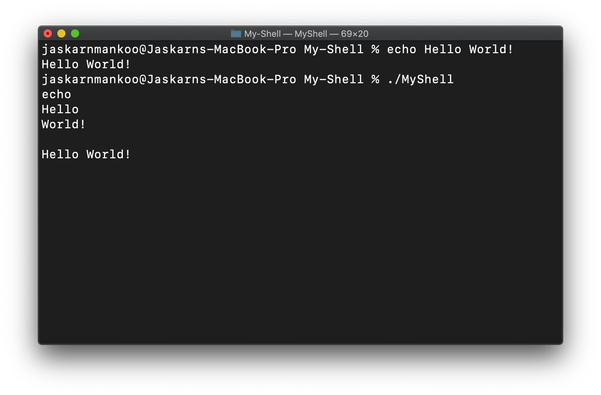

# my-shell

An individual project that is my own Linux shell. It can run most commands with a few limitations such as **"rm"** and **"cd"**. Rather than typing a command and arguments on one line, you have to type commands first, followed by arguments on new lines.

## Execution of "echo" command in My-Shell

